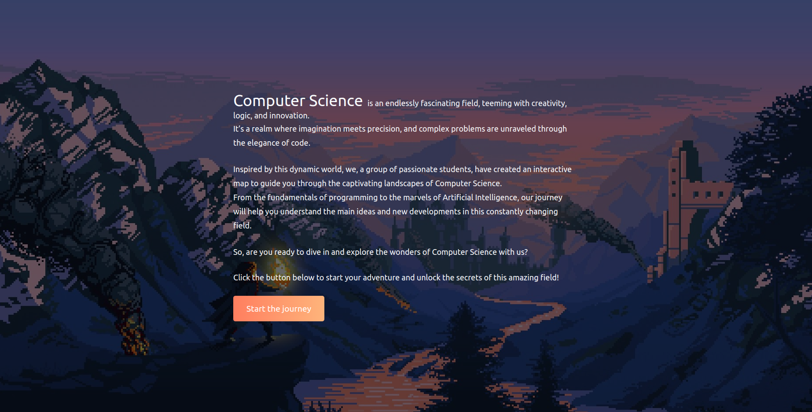

# The Map 🧭

**The Map** is an Interactive **2D** Website designed to represent the field of **Computer Science** for the **Methods and Practices in Informatics** Course.

## Preview

### Landing


### Info


### Loading


### Village


### House (Software Engineering)


### Papyrus (is scrollable)


## Technologies
- [Node.js](https://nodejs.org/en)
- [Next.js](https://nextjs.org/)
- [Pixi.js](https://pixijs.com/)
- [Pixel Art Resources](https://itch.io/game-assets/free/tag-pixel-art)

## Getting started

First, clone the repository on your computer:
```bash
git clone https://github.com/sebastiankalciov/the-map
```
Install [Node.js](https://nodejs.org/en)

Install the dependencies (inside the folder `the-map`):

```bash
npm install
```
Run the development server:
```bash
npm run dev
```

Open [http://localhost:3000](http://localhost:3000) in the browser to see **The Map**.

## Contributors
- Artiom Leliuhin,
- Bianca Vatavu,
- Ecaterina Manole,
- Elena Moglan,
- Ionuț Anghel,
- Maia Marin,
- Maria-Miruna Mesaroşiu,
- Natalia-Ana Matiuț,
- Radu Dinculescu,
- Raul-Andrei Ariton,
- Silviu-Ştefan Mitrea